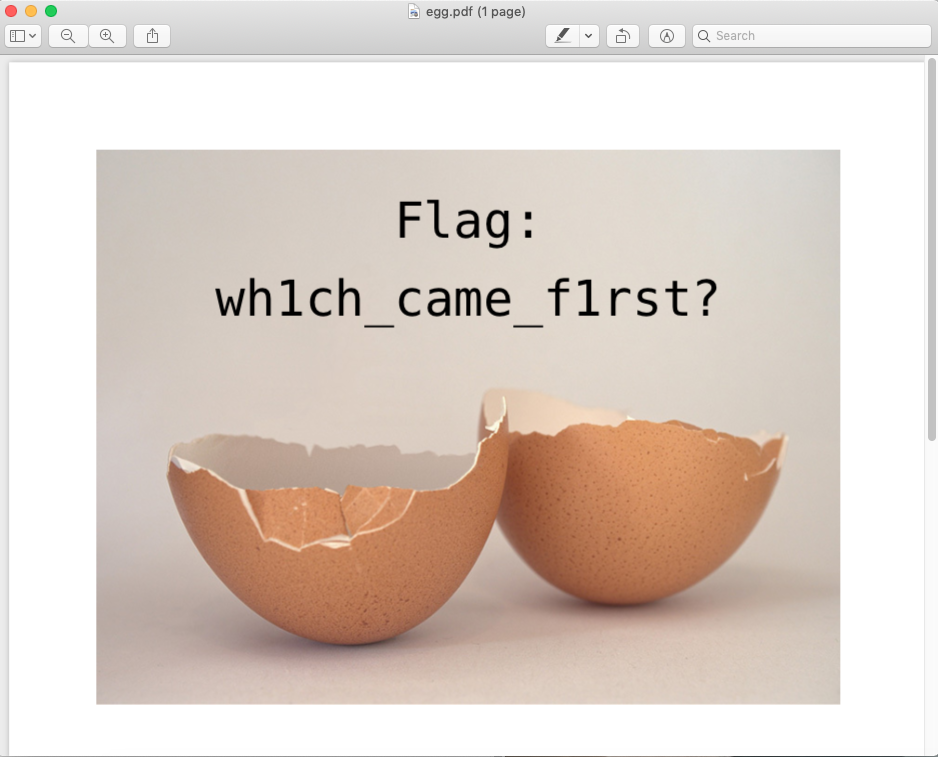

# BE01 (100 pts)

## Description: 
Download the file and find a way to get the flag.
[be01.zip](be01.zip)
## Approach
The challenge is provided as a pdf in the zip, so the first thing I did was use binwalk to check out what was inside. Using `binwalk chicken.pdf`, here was the output.
```console
binwalk chicken.pdf

DECIMAL       HEXADECIMAL     DESCRIPTION
--------------------------------------------------------------------------------
0             0x0             PDF document, version: "1.4"
72            0x48            Zip archive data, at least v1.0 to extract, compressed size: 550522, uncompressed size: 550522, name: egg.zip
550609        0x866D1         End of Zip archive, footer length: 22
551319        0x86997         Zlib compressed data, default compression
6478358       0x62DA16        Zlib compressed data, default compression
6478601       0x62DB09        End of Zip archive, footer length: 22
```
Seeing as to the fact that there are zip files within it, I decided to do a matryoshka extraction, which can be done in binwalk using `binwalk -e -M chicken.pdf`. Once that was done in the terminal, I went through the extract folder created until I came to egg.pdf which contained the image with the flag as shown below.


