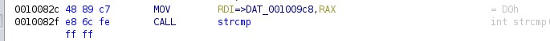

# BM01 (250 pts)

## Description
Download the file and find a way to get the flag.

## Approach
When we run the [program](bm01.zip), we get a prompt in Russian asking for the password. After some initial fuzzing, I decided to dig in using Ghidra. In the `main` function, I noticed that there is a strcmp as shown below which compares the input to a certain string at the address `DAT_001009c8`. 



Following this address, we get the hex `d0 bc d0 be d0 bb d0 be d1 82 d0 be d0 ba 31 32 33`; however, this isn't ASCII, rather UTF-8, and so I use that and get `молоток123`. Now, we can plug this into the program as below and we get the flag. 
```
pranav@pranav-VirtualBox:~/Desktop$ ./program
Какой пароль？
> молоток123
верный!

флаг: wh1te%BluE$R3d
```
## Flag
`wh1te%BluE$R3d`
