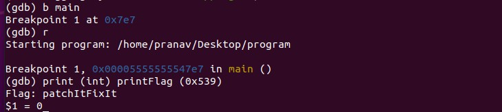

# BM02 (250 pts)

## Description
Download the file and find a way to get the flag.

## Approach
When we run the [file](bm02.zip), we get a very basic output with no input asked. Thus, we can dive right into Ghidra. The main function seems to be relatively straightforward, but the printFlag function seems promising. I noticed that the function works if `param_1 = 0x539` as shown below.

All we need to do now is load the program up into GDB, call the function printFlag with the parameter 0x539 to satisfy the requirement that we saw above, and get our flag! First we start off with a breakpoint at main, run the program, and then we can run the function. 

## Flag
`patchItFixIt`
