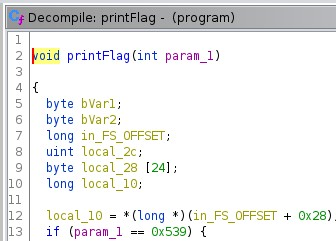

# BM02 (250 pts)

## Description
Download the file and find a way to get the flag.

## Approach
When we run the [file](bm02.zip), we get a very basic output with no input asked. Thus, we can dive right into Ghidra. The main function holds nothing, but the printFlag function seems promising. I noticed that the function works if `param_1 = 0x539` as shown below.

All we need to do now is go to the variable and set it to equal 0x539 to meet the requirements for printflag, which we can do in the main function as shown below.
