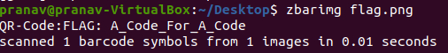

# CM01 (250 pts)

## Description
Download the file and find a way to get the flag.

## Approach
When we unzip the [file](cm01.zip), we get 2 images, one which seems to be a functional QR code and the other which is distorted. Scanning the first one, we get `Hey, I've put the flag into the other file using the same trick we always use. You know what to do. :)` Now, that's not exactly too helpful, but we can assume we'll have to manipulate the two QR codes together in some way to get the flag. We can start with xor since that's probably the easiest to do instead of digging into Photoshop. [This](https://ctftime.org/writeup/26471) was quite useful, and I downloaded the command line gmic using [this](website).

Now, we have a flag jpg which looks like a proper QR code, but trying to scan it with my phone didn't work. 

However, we can also use the command line to read the image using zbar (installed w/apt-get, name is `zbar-tools`). With the command below, we finally get the flag.

## Flag
`A_Code_For_A_Code`

