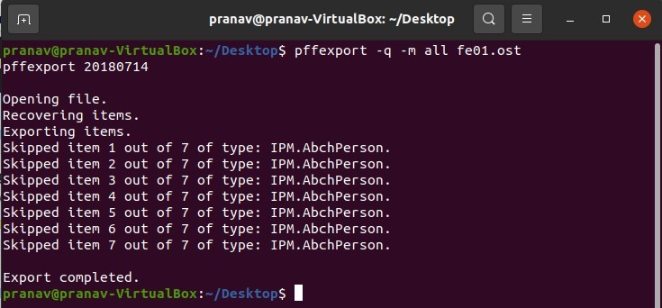
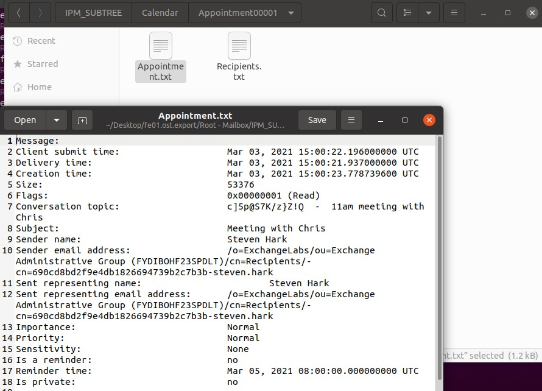

# FE01 (100 pts)

## Description
Download the file and find a way to get the flag.

[fe01.zip](fe01.zip)

## Approach
This is an outlook file, so we can use libpff to parse it (https://github.com/libyal/libpff). Here's the command I used as below.

After that, you can grep for flag using a command like `grep -inR "flag" .` or anything similar, and then I dug through some of the results. Eventually, I found a zip named `1_flag.zip`. However, it is password protected. Reading the attached email, it states `Here it is. The p/w is the same one I gave to you in the office when we arranged Fridays meeting. You still have that right?`. Since the sender was Chris, we can also grep for the name Chris, until we come upon this email. 

Using this odd string in the conversation topic, we can unlock the zip, finally getting the flag.

