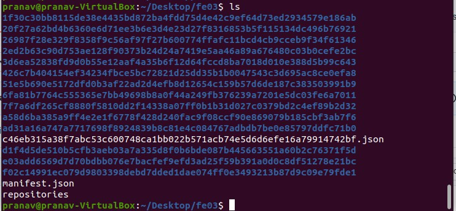

# FE03 (100 pts)

## Description
Download the file and find a way to get the flag from the docker image.

## Approach
Technically, we should open this using docker and go through the files, but I decided to do some digging around since there were only a handful of directories with one layer in each as shown below (and I didn't want to download docker for 300 mb)



Working our way from the bottom up, we find this upper and lowercase string in the 2nd to last directory, which we can assume is the flag since it says flag.txt

```pranav@pranav-VirtualBox:~/Desktop/fe03$ cd e03add6569d7d70bdbb076e7bacfef9efd3ad25f59b391a0d0c8df51278e21bc/
pranav@pranav-VirtualBox:~/Desktop/fe03/e03add6569d7d70bdbb076e7bacfef9efd3ad25f59b391a0d0c8df51278e21bc$ ls
json  layer.tar  VERSION
pranav@pranav-VirtualBox:~/Desktop/fe03/e03add6569d7d70bdbb076e7bacfef9efd3ad25f59b391a0d0c8df51278e21bc$ cat layer.tar
home/0040755000000000000000000000000014023411217010173 5ustar0000000000000000home/secret/0042755000014400001450000000000014023416047011513 5ustar0000000000000000home/secret/flag.txt0100777000000000000000000000004514023416024013136 0ustar0000000000000000Flag: 8191-SiMpLeFilESysTemForens1Cs
```

## Flag
`SiMpLeFilESysTemForens1Cs`
