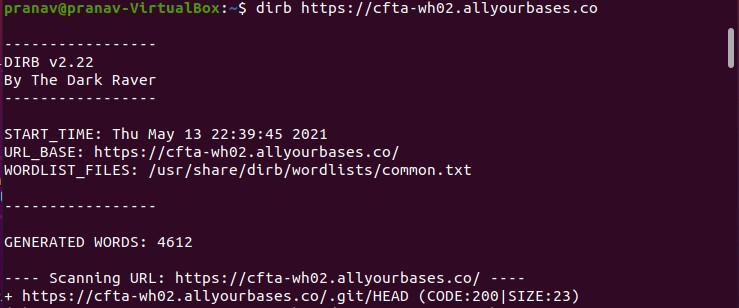

# WH02 (500 pts)

## Description
Access the site at https://cfta-wh02.allyourbases.co and find a way to get the flag

## Approach
Upon visiting the site, nothing stands out, so we can do some fuzzing which includes some sort of dirbusting; I used dirb for this as shown below.



We see a git directory underneath, so we can assume there is an open git index that we can access. There are multiple ways to dump this, but I decided to use this [script](https://github.com/internetwache/GitTools) which worked perfectly with this command.
```
pranav@pranav-VirtualBox:~/Desktop/NCLCTF$ ./gitdumper.sh https://cfta-wh02.allyourbases.co/.git/ Desktop/NCLCTF
```

Then, we can traverse through the directories or list everything out using `git log -p` to find the flag under setup.sh.

## Flag
`
