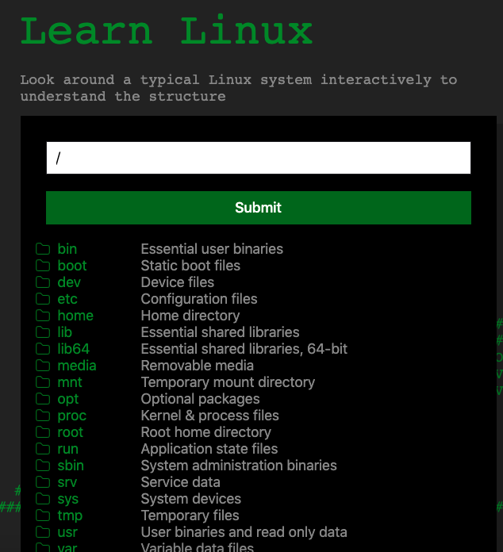
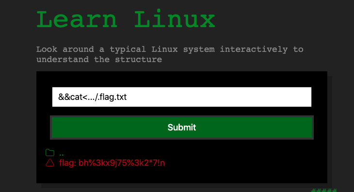

# WM05 (250 pts)

## Description
Access the site at https://cfta-wm05.allyourbases.co, then find and read the contents of the flag file, to get the flag.

## Approach
Initially, I decided to just look through some of the directories and see what was going on; I quickly found out however that there are much too many directories to simply look through. After going to the page source, we notice this value for the display as none.
```
<div class="container h-mt-5">
            <h1>Learn Linux</h1>
            <h2>Look around a typical Linux system interactively to understand the structure</h2>
            <div class="c-well">
                <form style="display: none">
                    <input type="text" id="path" class="c-form-input" name="path" value="/"><br>
                    <input type="submit" id="submit" class="c-btn c-btn--primary c-btn--block" value="Submit" type="button">
```
When we change this to true, we get access to a shell input, albeit critically restricted since we can't use spaces or do much of anything at all.



I found [this](https://www.betterhacker.com/2016/10/command-injection-without-spaces.html) website that had a neat trick for getting around this, which is using {command,arg}, so for example {ls,-a}. Now, once we run this, we notice some higher directories, so we can run `{ls,-a,...}`, which shows a hidden flag file. However, I couldn't cat it using this same method, so I looked for an alternative, which was using `&&`. We can run `&&cat<.../.flag.txt`, which essentially redirects the location of the file through cat. 



# Alternatives
Of course, there are multiple ways to solve this, for example using the variable ${IFS} as a whitespace or other ways to get around the filtering. You can also use Burpsuite to speed this up a bit, but I chose not to. 

## Flag
`bh%3kx9j75%3k2*7!n`

